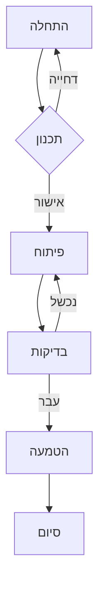
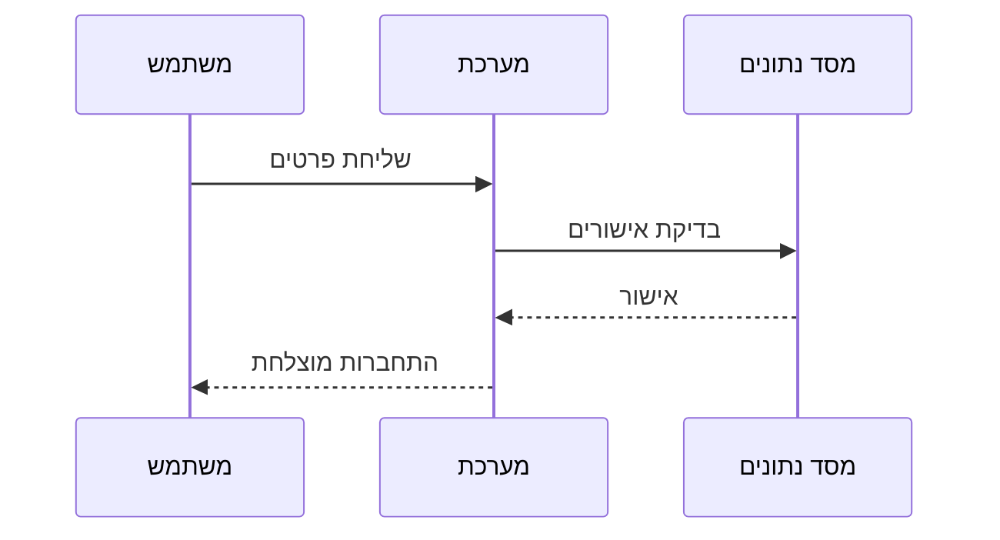
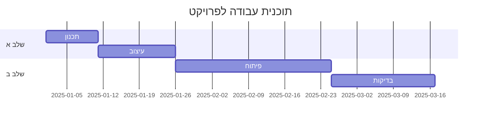
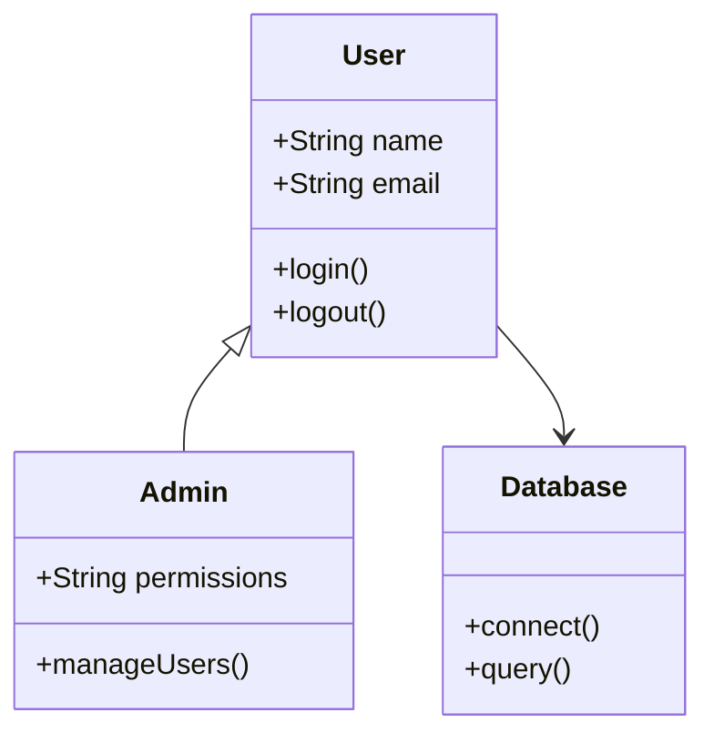

# שלום עולם - Hebrew RTL Markdown
## קובץ תיעוד בעברית jhk fdgg jjjdasfasdfas שלום **חברים**
זהו קובץ markdown שמסביר על איך עובדים עם Cobol עעע עם תמיכה מלאה בעברית וכיווניות RTL (מימין לשמאל).
fff
## תוכן העניינים
**_- **הקדמה **1**
- *מאפיינים*

- ~~דוגמה~~

- <u>טבלאות</u>

- **~~בולד~~**

## הקדמה
זה קובץ markdown שנכתב בעברית עם תמיכה מלאה בכיווניות מימין לשמאל.
המטרה של קובץ זה היא להדגים כיצד לכתוב תיעוד בעברית עם יישור תקין לימין.
### מה זה RTL?
RTL משמעותו Right-To-Left (מימין לשמאל). זו הכיווניות הטבעית של שפות שונות כמו:
- ***~~<u>עברית</u>~~***

- ערבית

- פרסית

- אורדו
עמודה 1
עמודה 2
עצודה 3
this is an english text
english עם עברית
עברית with english

- עברית

- eng;lish

- english עם עברית ושילוב של english and 122

## מאפיינים
הקובץ הזה כולל את המאפיינים הבאים:
✓ **טקסט עברי** - כל הטקסט כתוב בעברית נקייה
✓ **יישור לימין** - הטקסט מיושר לצד ימין של הדף
✓ **כיווניות RTL** - הטקסט זורם מימין לשמאל
✓ **עיצוב עברי** - כותרות, רשימות וטבלאות בעברית
✓ **תאימות** - עובד בכל קורא markdown
## טבלת מאפיינים

טבלה חדשה
| גכק/׳כ/ק | ג׳/ק |  |
| --- | --- | --- |
| ג/׳ |  |  |
| כק/׳כ |  |  |

| מאפיין | תיאור | סטטוס |
| --- | --- | --- |
| טקסט עברי | תמיכה מלאה בשפה העברית | ✓ פעיל |
| RTL כיווניות | זרימת טקסט מימין לשמאל | ✓ פעיל |
| יישור לימין | יישור הטקסט לצד ימין | ✓ פעיל |
| עיצוב מתקדם | קוד, טבלאות, וציטוטים | ✓ פעיל |
| רב-שפתיות | תמיכה בעברית ואנגלית | ✓ פעיל |

## טבלה ידנית
| כגדד | כגקכ | כקר |
| --- | --- | --- |
| כדגשקכקשכקכק |  |  |
| fsdfsdgsdgsdsdgsdfasdfasdfasdfasffasfas |  |  |


## דוגמאות
### דוגמה 1: טקסט בסיסי
- זה טקסט רגיל בעברית. אנחנו יכולים להשתמש ב**הדגשה חזקה** וב*הדגשה קלה*.

- fwefewfew

- fsefsese

- כקכ'ק'ק

- ככככ

- כמו כן, אנחנו יכולים להשתמש ב~~טקסט שכיב~~ ובקישורים.

### דוגמה 2: רשימה מסודרת
תהליך העבודה:
- ההכנה - הכנת כל החומרים הדרושים

- התכנון - תכנון מפורט של העבודה

- ההוצאה לפועל - ביצוע המטלות

- בדיקה - בדיקת העבודה שהתבצעה

- הגמר - סיום וסיכום

### דוגמה 3: רשימה לא מסודרת
דברים חשובים:
- רשימה ראשונה

- תת-רשימה א

- תת-רשימה ב

- רשימה שנייה

- רשימה שלישית

- תת-רשימה ג

- תת-רשימה ד

## טבלאות
| תיאור | ערך | סטטוס |
| --- | --- | --- |
| פריט ראשון | 100 | ✓ פעיל |
| פריט שני | 200 | ✓ פעיל |
| פריט שלישי | 150 | ✗ לא פעיל |
| פריט רביעי | 300 | ✓ פעיל |

### טבלה נוספת - רשימת משימות
| משימה | אחראי | תאריך |
| --- | --- | --- |
| כתיבת תיעוד ddd | דוד | 2025-12-17 |

## דיאגרמות Mermaid
### דיאגרמת זרימה - תהליך פיתוח



### דיאגרמת Sequence - תהליך התחברות



### דיאגרמת Gantt - לוח זמנים של פרויקט



### דיאגרמת Class - מבנה מערכת



| ddd בדיקת קוד | מרים | 2025-12-18 | | 11 ddd פרסום 222 fff | ישראל | 2025-12-19 |
### טבלה שלישית - דירוג ושיעורים
| שיעור | מורה | חדר | זמן |
| --- | --- | --- | --- |
| מתמטיקה ff 222 | רן | 101 | 09:00-10:00 |
| עברית | נעמי | 102 | 10:15-11:15 |
| אנגלית | ג'ון | 103 | 11:30-12:30 |
| ספרות | דינה | 104 | 14:00-15:00 |
| תרבות | אמיר | 105 | 15:15-16:15 |

### טבלה רביעית - ציוני סטודנטים
הנוסחה לחישוב הממוצע (Average Formula):

$$\text{Average} = \frac{\sum_{i=1}^{n} x_i}{n}$$

כאשר:
- $n$ = מספר הערכים

- $x_i$ = הערך ה-$i$

- $\sum$ = סימן הסכום

| שם | מתמטיקה | עברית | אנגלית | ממוצע |
| --- | --- | --- | --- | --- |
| דוד | 95 | 88 | 92 | 91.7 |
| מרים | 87 | 94 | 90 | 90.3 |
| ישראל | 92 | 85 | 95 | 90.7 |
| רחל | 98 | 96 | 93 | 95.7 |
| יוחנן | 80 | 82 | 85 | 82.3 |

### טבלה חמישית - תוכן ספרייה
| סוג ספר | כותר | מחבר | שנה | עותק |
| --- | --- | --- | --- | --- |
| רומן | "מתנגדים" | יצחק בן נחום | 1984 | 3 |
| דרמה | "המלט" | וויליאם שכספיר | 1603 | 2 |
| שירה | "קול קורא" | יהודה עמיחי | 1948 | 4 |
| חינוך | "הכתיב" | לוי אקרמן | 2005 | 5 |
| היסטוריה | "מסע דרך הזמן" | דוד בכי | 2010 | 1 |

## קוד
### דוגמה: Python
```
def greet(name):
    """
    Function that prints a greeting message
    """
    print(f"Hello {name}!")

# Function call
greet("World")

# More examples
numbers = [1, 2, 3, 4, 5]
for num in numbers:
    print(f"Number: {num}")

```
### דוגמה: JavaScript
```
// Function to greet a user
function greet(name) {
    return `Hello ${name}!`;
}

// Variable declarations
const message = greet("World");
const count = 42;

console.log(message);
console.log(`Count: ${count}`);

// Array operations
const items = ["apple", "banana", "orange"];
items.forEach(item => console.log(item));

```
### דוגמה: HTML &amp; CSS
```

    
    
    Sample Page
    
        body {
            font-family: Arial, sans-serif;
            background-color: #f5f5f5;
            margin: 20px;
        }
        .container {
            max-width: 800px;
            margin: 0 auto;
            background-color: white;
            padding: 20px;
            border-radius: 8px;
            box-shadow: 0 2px 4px rgba(0,0,0,0.1);
        }
        h1 {
            color: #333;
        }
        .highlight {
            background-color: #ffffcc;
            padding: 10px;
            border-left: 4px solid #ffeb3b;
        }
    

    
        # Welcome

        This is a sample HTML page with English content.

        
            This is a highlighted section with important information.

        
    

```
### דוגמה: SQL
```
-- Create a users table
CREATE TABLE users (
    id INT PRIMARY KEY AUTO_INCREMENT,
    username VARCHAR(50) NOT NULL UNIQUE,
    email VARCHAR(100) NOT NULL,
    created_at TIMESTAMP DEFAULT CURRENT_TIMESTAMP
);

-- Insert sample data
INSERT INTO users (username, email) VALUES 
('john_doe', 'john@example.com'),
('jane_smith', 'jane@example.com'),
('bob_wilson', 'bob@example.com');

-- Query to retrieve users
SELECT * FROM users WHERE created_at > DATE_SUB(NOW(), INTERVAL 7 DAY);

-- Update user email
UPDATE users SET email = 'newemail@example.com' WHERE username = 'john_doe';

```
### דוגמה: JSON
```
{
  "project": "Hebrew RTL Documentation",
  "version": "1.0",
  "author": "Development Team",
  "settings": {
    "direction": "rtl",
    "language": "Hebrew",
    "encoding": "UTF-8"
  },
  "features": [
    {
      "name": "Hebrew Support",
      "enabled": true,
      "priority": "high"
    },
    {
      "name": "RTL Alignment",
      "enabled": true,
      "priority": "high"
    },
    {
      "name": "Mermaid Diagrams",
      "enabled": true,
      "priority": "medium"
    }
  ],
  "contributors": [
    "Alex",
    "Maria",
    "John"
  ]
}

```
## ציטוטים

> "השפה העברית היא אחת השפות העתיקות ביותר בעולם,
> וההשפעה שלה על התרבות האנושית חיובית וגדולה."

> **ציטוט משכנעי:**
> "כתיבה בעברית מחזקת את הזיכרון ואת הזהות התרבותית שלנו."
## הוראות להשתמש בקובץ זה
### שלב 1: פתיחה
פתח את הקובץ בעורך markdown כלשהו.
### שלב 2: עריכה
ערוך את התוכן לפי הצורך שלך.
### שלב 3: שמירה
שמור את הקובץ בתבנית `.md`.
### שלב 4: הצגה
הצג את הקובץ בדפדפן או בתוכנה התומכת ב-RTL.
## ניסיון עם עיצוב מתקדם
### עם emojis בעברית
📚 **ספרים** - מקורות ידע
💻 **מחשבים** - כלים טכנולוגיים sss
🌍 **עולם** - קהילה גלובלית
✍️ **כתיבה** - אמצעי תקשורת
## תמיכה טכנית
### דרישות
- עורך markdown

- תמיכה בעברית (UTF-8)

- דפדפן תומך RTL

### שפות תומכות
- Python ✓

- JavaScript ✓

- Java ✓

- C# ✓

- PHP ✓

## הערות חשובות
⚠️ **הערה 1:** ודא שהקידוד הוא UTF-8
⚠️ **הערה 2:** כמה תוכנות לא תומכות בעברית במלואה
ℹ️ **הערה 3:** השתמש ב-`dir="rtl"` ב-HTML לתמיכה טובה יותר
## דיאגרמות Mermaid
### דיאגרמה 1: תהליך עבודה


### דיאגרמה 2: מבנה ארגוני


### דיאגרמה 3: מחזור חיים של פרויקט


### דיאגרמה 4: דיאגרמת מצב


### דיאגרמה 5: תרשים גנט


## קישורים שימושיים
- GitHub - עברית

- Stack Overflow - עברית

- Wikipedia - עברית

- MDN - תיעוד ווב

## סיכום
קובץ markdown זה מדגים את המאפיינים החיוניים:
✅ **תמיכה מלאה בעברית**
✅ **יישור לימין נכון**
✅ **כיווניות RTL**
✅ **עיצוב ושינוע**
✅ **קוד וטבלאות fff**
## יוצר ותאריך
**יוצר:** סוכן AI 333
**תאריך יצירה:** 17 בדצמבר 2025
**גרסה:** 1.0
**שפה:** עברית
*קובץ זה נוצר כדי להדגים עברית RTL במרקדאון. ניתן להשתמש בו כתבנית לתיעוד נוסף בעברית.*